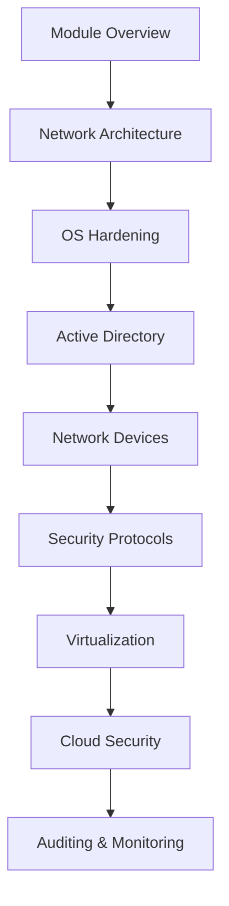

# Network and System Security 🛡️

A comprehensive learning module covering essential principles of network and system security, including secure protocols, OS hardening, cloud security, and network device protection using modern techniques.

## 📋 Overview

This module focuses on developing skills in **designing, implementing, and managing** secure computer networks and systems to protect against cyber attacks. You'll learn industry-standard tools and techniques to harden various environments including Windows, Linux, Active Directory, routers, and cloud platforms.

## 🎯 Learning Outcomes

- ✅ Understand network and system security principles
- ✅ Design and implement secure network architectures  
- ✅ Harden operating systems (Windows & Linux) and network devices
- ✅ Secure cloud, virtual, and containerized environments
- ✅ Monitor and audit systems for compliance and anomaly detection

## 📚 Module Contents

| # | Topic | Badge | Description |
|---|-------|-------|-------------|
| 01 | [Secure Network Architecture](01-secure-network-architecture.md) |  | Design secure network environments using defense-in-depth principles |
| 02 | [Linux System Hardening](02-linux-system-hardening.md) |  | Improve security posture of Linux systems through configuration |
| 03 | [Microsoft Windows Hardening](03-microsoft-windows-hardening.md) |  | Mitigate key attack vectors using Windows hardening techniques |
| 04 | [Active Directory Hardening](04-active-directory-hardening.md) |  | Understand AD security fundamentals and defense strategies |
| 05 | [Network Device Hardening](05-network-device-hardening.md) |  | Secure routers, switches, and firewalls against attacks |
| 06 | [Network Security Protocols](06-network-security-protocols.md) |  | Learn secure communication protocols across OSI layers |
| 07 | [Virtualization and Containers](07-virtualization-and-containers.md) |  | Secure virtual and container environments |
| 08 | [Intro to Cloud Security](08-intro-to-cloud-security.md) |  | Secure cloud environments and manage shared responsibility |
| 09 | [Auditing and Monitoring](09-auditing-and-monitoring.md) |  | Continuously audit and monitor systems for threats |

## 🚀 Getting Started

1. **Review the Overview**: Start with the main module introduction to understand the scope
2. **Follow the Sequence**: Topics are organized from foundational to advanced concepts
3. **Practical Application**: Each topic includes hands-on techniques and best practices
4. **Progressive Learning**: Build upon knowledge from previous sections

## 🛠️ Prerequisites

- Basic understanding of networking concepts
- Familiarity with operating systems (Windows/Linux)
- Fundamental knowledge of cybersecurity principles

## 📖 Learning Path

## 🔧 Tools & Technologies Covered

- **Firewalls & ACLs**
- **SELinux/AppArmor**
- **Group Policy**
- **Active Directory**
- **TLS/SSH/IPsec**
- **Docker/Kubernetes**
- **Cloud IAM & NSGs**
- **SIEM Solutions**

## 📈 Progress Tracking

*Start your learning journey today!*

## 🤝 Contributing

This module is designed for educational purposes. Suggestions and improvements are welcome to keep the content current with evolving security landscapes.

---

**⭐ Remember to star this repository if you find it helpful!**

---
